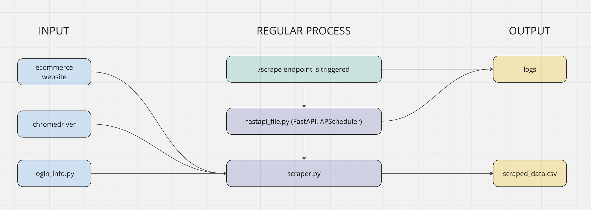

# ecommerce_parcing

This architecture is an example of an e-commerce website parcing.

Here is a quick video of how it works: https://youtu.be/Tu2o3SrzJnM. If you are curious to see what the output looks like, open scraped_data.csv in this repo.

Quick setup:
- pip install -r requirements.txt
- Download the repo
- Substitute chromedriver_placeholder with actual chromedriver
- Fill in login_info_placeholder.py and change it's name to login_info.py
- Line 13 in scraper.py - provide the right path
- Lines 38 and 43 in scraper.py - remove limitation if needed
- Type in your terminal "uvicorn fastapi_file:app --host 0.0.0.0 --port 8000"
- Type in any other device's browser under the same network "http://IP_OF_THE_LOCAL_COMPUTER:8000/scrape"
- Once it's done, it scrapes data in csv and repeats this procedure after a specific interval (customizable in fastapi_file.py)

UPD: scraper.py logs errors now as well

Disclaimer: This project includes code for a one-time web parcing example, created solely for educational purposes. It is not intended for continuous or automated scraping of any website. Please ensure you adhere to the terms of service of any website you interact with, as this code is provided as an example and not for production use. Sail.ca website was chosen randomly for this project and the only goal of this code is educational.
